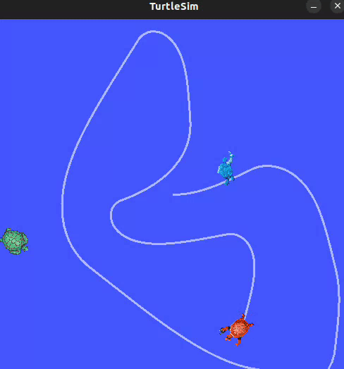

# Turtlesim Catch Them All
Mini project based on the turtlesim package of ROS (Robot Operating System) proposed on the course "ROS2 For Beginners" by Edourard Renard.
In this project, a master turtle aims to catch all the other turtles in the environment. New turtles are spawned periodically and the master turtle catches always the closest turtle to it in a given moment.



## Environment setup
- Make sure you have a ROS2 workspace configured, such as taught in the ROS2 Official Documentation: https://docs.ros.org/en/foxy/Tutorials/Beginner-Client-Libraries/Creating-A-Workspace/Creating-A-Workspace.html
- After that, clone this repository inside the ROS2 workspace and build packages
```shell
colcon build
```
- Then run the launch file
```shell
ros2 launch turtle_bringup turtlesim_catch_them_all.launch.py
```
